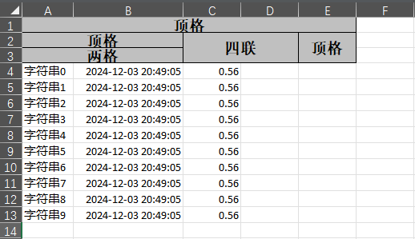

# 表头
本章节将介绍写入 Excel 中的表头数据。

## 复杂头写入

### 概述
支持设置多级表头，通过 `@ExcelProperty` 注解指定主标题和子标题。

### POJO类
```java
@Getter
@Setter
@EqualsAndHashCode
public class ComplexHeadData {
    @ExcelProperty({"主标题", "字符串标题"})
    private String string;
    @ExcelProperty({"主标题", "日期标题"})
    private Date date;
    @ExcelProperty({"主标题", "数字标题"})
    private Double doubleData;
}
```

### 代码示例
```java
@Test
public void complexHeadWrite() {
    String fileName = "complexHeadWrite" + System.currentTimeMillis() + ".xlsx";
    FastExcel.write(fileName, ComplexHeadData.class)
        .sheet()
        .doWrite(data());
}
```

### 结果


---

## 动态头写入

### 概述
实时生成动态表头，适用于表头内容动态变化的场景。

### 代码示例
```java
@Test
public void dynamicHeadWrite() {
    String fileName = "dynamicHeadWrite" + System.currentTimeMillis() + ".xlsx";

    List<List<String>> head = Arrays.asList(
        Collections.singletonList("动态字符串标题"),
        Collections.singletonList("动态数字标题"),
        Collections.singletonList("动态日期标题"));

    FastExcel.write(fileName)
        .head(head)
        .sheet()
        .doWrite(data());
}
```

### 结果

