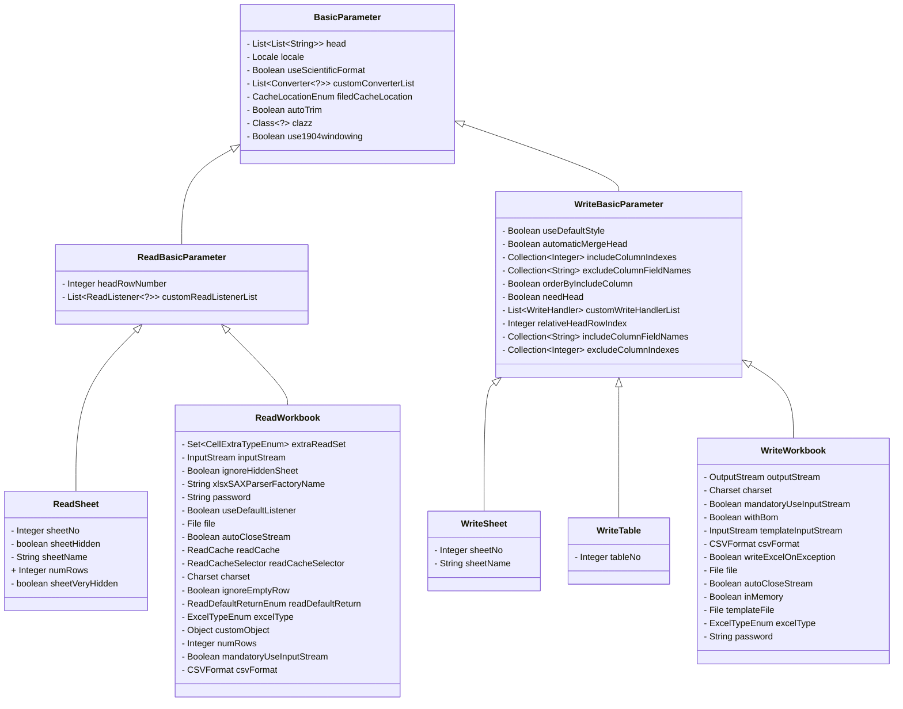

# 参数
本章节介绍使用 FastExcel 中的参数。

## 类图

## 通用参数

所有参数，都继承自`BasicParameter`

| 名称                  | 默认值   | 描述                                                                                   |
|---------------------|-------|--------------------------------------------------------------------------------------|
| head           | 空     | 与`clazz`二选一。读取文件头对应的列表，会根据列表匹配数据，建议使用class                                           |
| clazz           | 空     | 与`head`二选一。读取文件的头对应的class，也可以使用注解。如果两个都不指定，则会读取全部数据                                  |
| customConverterList           | 空     | 默认加载了很多转换器，这里可以加入不支持的字段                                                              |
| autoTrim           | true  | 会对表头、读取数据等进行自动去除前后空格                                                                 |
| use1904windowing           | false | excel中时间是存储1900年起的一个双精度浮点数，但是有时候默认开始日期是1904，所以设置这个值改成默认1904年开始                       |
| useScientificFormat           | false | 数字转文本的时候在较大的数值的是否是否采用科学计数法                                                           |
| locale           | 空 | 此参数用于格式化日期和数字                                                                        |
| filedCacheLocation           | THREAD_LOCAL | 解析class的field会有缓存，默认放到ThreadLocal ，也就是说每次读写都会重新解析class，可以反射修改class的注解，并发场景不会相互影响 THREAD_LOCAL：默认，每次读写都会缓存，但是不是同一次不会影响 MEMORY：放到全局的内存里面，理论上性能会更好，但是无法通过反射、排除等方法修改导出的对象 NONE：不缓存，性能会变差，涉及到读的同时要写，而且还要反射、排除等方法去修改对象的情况下可以考虑使用。 |

## 读操作

### ReadBasicParameter 通用参数

| 名称                  | 默认值   | 描述                                                       |
|---------------------|-------|----------------------------------------------------------|
| customReadListenerList           | 空     | 可以注册多个监听器，读取excel的时候会不断的回调监听器中的方法                        |
| headRowNumber           | 1     | excel中头的行数，默认1行                                          |

### ReadWorkbook 参数

| 名称                  | 默认值                     | 描述                                                                                                                                                                                                                                                                                                        |
|---------------------|-------------------------|-----------------------------------------------------------------------------------------------------------------------------------------------------------------------------------------------------------------------------------------------------------------------------------------------------------|
| excelType           | 空                       | 当前excel的类型,支持XLS、XLSX、CSV                                                                                                                                                                                                                                                                                 |
| inputStream           | 空                       | 与`file`二选一。读取文件的流，如果接收到的是流就只用，不用流建议使用`file`参数。因为使用了`inputStream` FastExcel会帮忙创建临时文件，最终还是`file`                                                                                                                                                                                                            |
| file           | 空                       | 与`inputStream`二选一。读取文件的文件。                                                                                                                                                                                                                                                                                |
| mandatoryUseInputStream           | false                   | 强制使用  `inputStream` 来创建对象，性能会变差，但是不会创建临文件。                                                                                                                                                                                                                                                                |
| charset           | Charset#defaultCharset  | 只有csv文件有用，读取文件的时候使用的编码                                                                                                                                                                                                                                                                                    |
| autoCloseStream           | true                    | 自动关闭读取的流。                                                                                                                                                                                                                                                                                                 |
| readCache           | 空                       | 默认小于5M用 内存，超过5M会使用 `EhCache`,这里不建议使用这个参数。                                                                                                                                                                                                                                                                 |
| readCacheSelector           | SimpleReadCacheSelector | 用于选择什么时候用内存去存储临时数据，什么时候用磁盘存储临时数据                                                                                                                                                                                                                                                                          |
| ignoreEmptyRow           | true                    | 忽略空的行                                                                                                                                                                                                                                                                                                     |
| password           | 空                       | 读取文件的密码                                                                                                                                                                                                                                                                                                   |
| xlsxSAXParserFactoryName           | 空                       | 指定sax读取使用的class的名称，例如：`com.sun.org.apache.xerces.internal.jaxp.SAXParserFactoryImpl`                                                                                                                                                                                                                      |
| useDefaultListener           | true                    | 默认会加入`ModelBuildEventListener` 来帮忙转换成传入`class`的对象，设置成`false`后将不会协助转换对象，自定义的监听器会接收到`Map<Integer,CellData>`对象，如果还想继续接听到`class`对象，请调用`readListener`方法，加入自定义的`beforeListener`、 `ModelBuildEventListener`、 自定义的`afterListener`即可。                                                                              |
| extraReadSet           | 空                       | 额外需要读取内容的set，默认不读取这些数据                                                                                                                                                                                                                                                                                    |
| readDefaultReturn           | STRING                  | STRING:会返回一个Map&lt;IntegerString&gt;的数组，返回值就是你在excel里面不点击单元格看到的内容    ACTUAL_DATA：会返回一个Map&lt;Integer,Object&gt;的数组，返回实际上存储的数据，会帮自动转换类型，Object类型为`BigDecimal`、`Boolean`、`String`、`LocalDateTime`、null，中的一个， READ_CELL_DATA: 会返回一个Map&lt;Integer,ReadCellData&lt;?&gt;&gt;的数组,其中`?`类型参照ACTUAL_DATA的 |
| customObject           | STRING                  | STRING:会返回一个Map&lt;IntegerString&gt;的数组，返回值就是你在excel里面不点击单元格看到的内容    ACTUAL_DATA：会返回一个Map&lt;Integer,Object&gt;的数组，返回实际上存储的数据，会帮自动转换类型，Object类型为`BigDecimal`、`Boolean`、`String`、`LocalDateTime`、null，中的一个， READ_CELL_DATA: 会返回一个Map&lt;Integer,ReadCellData&lt;?&gt;&gt;的数组,其中`?`类型参照ACTUAL_DATA的 |
| numRows           | 0                       | 读取指定的行数,0表示不限制行数，即读取所有行                                                                                                                                                                                                                                                                                   |
| ignoreHiddenSheet           | true                    | `@since 1.3.0`  忽略隐藏的sheet                                                                                                                                                                                                                                                                            |
| csvFormat           | CSVFormat.DEFAULT       | `@since 1.3.0`  设置 CSVFormat 对象，仅对 csv 文件有效                                                                                                                                                                                                                                                           |

### ReadSheet 参数

| 名称                  | 默认值   | 描述                            |
|---------------------|-------|-------------------------------|
| sheetNo           | 0     | 需要读取Sheet的编码，建议使用这个来指定读取哪个Sheet |
| sheetName           | 空     | 根据名字去匹配Sheet                  |
| sheetHidden           | false | Sheet 页普通隐藏状态                 |
| sheetVeryHidden           | false     | Sheet 页绝对隐藏状态                   |
| numRows           | 0     | 读取指定的行数,0表示不限制行数，即读取所有行       |

## 写操作

### WriteBasicParameter 通用参数

| 名称                  | 默认值   | 描述                                                                                                                                                                                                                                                                                  |
|---------------------|-------|-------------------------------------------------------------------------------------------------------------------------------------------------------------------------------------------------------------------------------------------------------------------------------------|
| customWriteHandlerList           | 空     | 写的处理器。可以实现`WorkbookWriteHandler`,`SheetWriteHandler`,`RowWriteHandler`,`CellWriteHandler`，在写入excel的不同阶段会调用                                                                                                                                                                          |
| relativeHeadRowIndex           | 0     | 写入到excel和上面空开几行                                                                                                                                                                                                                                                                     |
| needHead           | true  | 是否需要写入头到excel                                                                                                                                                                                                                                                                       |
| useDefaultStyle           | true  | 是否使用默认的样式                                                                                                                                                                                                                                                                           |
| automaticMergeHead           | true  | 自动合并头，头中相同的字段上下左右都会去尝试匹配                                                                                                                                                                                                                                                            |
| excludeColumnIndexes           | 空     | 需要排除对象中的index的数据                                                                                                                                                                                                                                                                    |
| excludeColumnFieldNames           | 空     | 需要排除对象中的字段的数据                                                                                                                                                                                                                                                                       |
| includeColumnIndexes           | 空     | 只要导出对象中的index的数据                                                                                                                                                                                                                                                                    |
| includeColumnFieldNames           | 空     | 只要导出对象中的字段的数据                                                                                                                                                                                                                                                                       |
| orderByIncludeColumn           | false | 在使用了参数includeColumnFieldNames 或者 includeColumnIndexes的时候，会根据传入集合的顺序排序                                                                                                                                                                                                  |

### WriteWorkbook 参数

| 名称                  | 默认值                    | 描述                                      |
|---------------------|------------------------|-----------------------------------------|
| excelType           | 空                      | 当前excel的类型,支持XLS、XLSX、CSV               |
| outputStream           | 空                      | 与`file`二选一。写入文件的流                       |
| file           | 空                      | 与`outputStream`二选一。写入的文件                |
| templateInputStream           | 空                      | 模板的文件流                                  |
| templateFile           | 空                      | 模板文件                                    |
| charset           | Charset#defaultCharset | 只有csv文件有用，写入文件的时候使用的编码                  |
| autoCloseStream           | true                   | 自动关闭写入的流。                               |
| password           | 空                      | 读取文件的密码                                 |
| inMemory           | false                  | 是否在内存处理，默认会生成临时文件以节约内存。内存模式效率会更好，但是容易OOM |
| writeExcelOnException           | false                  | 写入过程中抛出异常了，是否尝试把数据写入到excel              |
| withBom           | true                   | 在 csv 文件中设置编码前缀，否则 office 软件可能会显示乱码     |
| mandatoryUseInputStream           | false                   | 强制使用  `outputStream` 来创建对象，性能会变差，但是不会创建临文件。
| csvFormat           | CSVFormat.DEFAULT       | `@since 1.3.0`  设置 CSVFormat 对象，仅对 csv 文件有效                                                                                                                                                                                                                                                           |

### WriteSheet 参数

| 名称 | 默认值 | 描述 |
|---------------------|-----|---------------------------------|
| sheetNo | 0 | 需要写入的编码 |
| sheetName | 空 | 需要写的Sheet名称，默认同`sheetNo`                |

### WriteTable 参数

| 名称                  | 默认值 | 描述                              |
|---------------------|-----|---------------------------------|
| tableNo           | 0   | 需要写入的编码            |
